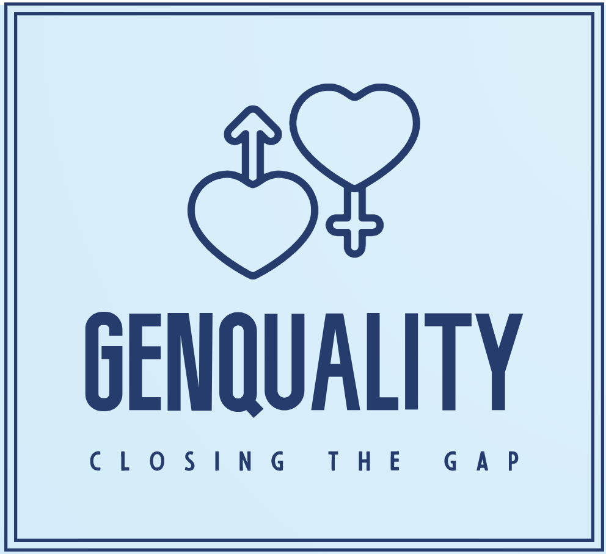

- [Site Overview](#site-overview)
  - [Goal](#goal)
  - [Technologies used](#technologies-used)
  - [User Stories](#user-stories)
  - [Features](#features)
    - [Existing Features](#existing-features)
    - [Future Features](#future-features)
  - [Design](#design)
    - [Wireframes](#wireframes)
    - [Typography](#typography)
    - [Images](#images)
    - [Colour Scheme](#colour-scheme)
  - [Testing](#testing)
  - [The Team](#the-team)
- [Credits](#credits)
    - [Github cards](#github-cards)
    - [Images](#images-1)
    - [Version Control](#version-control)

# Site Overview
Genquality is a website built as a project for September's Hackathon with Code Institute, Deloitte and Trust in Soda. The theme given was 'Closing the gender gap' and so we decided a good way to tackle this issue was with an educational and enlightening quiz, along with some resources and information on how the user can make a difference.

## Goal
The goal of our website is to see how aware the user really is about the gender gap. Some users might be shocked by some of the facts and statistics, while others may not. For those with less knowledge about the topic, we want to provide resources where they can learn more and also how they can help close the gap in their workplace and their life. The overall aim of this project is to bring awareness to the inequality in workplaces, each gender being affected in different ways.

## Technologies used

- [HTML5](https://en.wikipedia.org/wiki/HTML5) for the contents and structure of the website.
- [CSS3](https://en.wikipedia.org/wiki/CSS) for the styling and animations.
- [Balsamiq](https://balsamiq.com/) for wireframing.
- [GitPod](https://gitpod.io/) as a local IDE & repository.
- [GitHub](https://github.com/) as a remote repository.
- [GitHub Pages](https://pages.github.com/) to deploy the website.
- [Chrome](https://www.google.com/intl/en_ie/chrome/),  [Firefox](https://www.mozilla.org/en-US/firefox/new/),
[Brave Browser](https://brave.com/),
[Edge](https://www.microsoft.com/en-us/edge) and [Opera](https://www.opera.com/) for browser testing the responsiveness.
- [Chrome Developer Tools](https://developer.chrome.com/docs/devtools/) for testing screen sizes and using [Lighthouse](https://developers.google.com/web/tools/lighthouse).
- [Remove Image Background](https://www.remove.bg/) to remove background from logo.
- [Wave Chrome extension](https://wave.webaim.org/) to check web accessibility.
- [Pesticide Chrome extension](https://chrome.google.com/webstore/detail/pesticide-for-chrome-with/neonnmencpneifkhlmhmfhfiklgjmloi) during development.
- [Am I Responsive](http://ami.responsivedesign.is/) for testing and to make responsive image.

## User Stories

## Features

### Existing Features

### Future Features

## Design
We went into this project with the aim of being unbiased to any gender, and also making the information as clear and concise as possible. 

### Wireframes

[Wireframe](project_files/wireframes/wireframe.png)

### Typography

For our fonts, we decided to use 'Karla', a sans serif font, and 'Inconsolata'. We felt these two fonts complimented each other well; the simplicity of 'Inconsolata' helping us portray our information as factual and official.

### Images

Images that were used varied from stock images of co-workers, to protest signs and cartoon illustrations. We wanted to show all the different sides to this topic and we feel the images we've chosen show this.

### Colour Scheme

For our colour scheme, we used coolors.co to generate a palette that we felt was neutral enough not to bias any particular gender, and was also light enough that text and other images would contrast well with the colours. 

## Testing

## The Team

* https://github.com/petrugio
* https://github.com/Raivis80
* https://github.com/lukaszkukla
* https://github.com/Tiyko
* https://github.com/gracemcken

# Credits

### Github cards
Github cards were generated using [GitHub Dev Widget](https://github-devprofile-card.netlify.app/generate).

### Images
* Some images were taken from [pexels.com](pexels.com).
* [This image](assets/images/gender-equality.jpg) by <a href="https://www.freepik.com/free-vector/gender-equality-concept_8944679.htm#query=gender%20equality&position=13&from_view=keyword">Freepik</a>
* [This image](assets/images/equal.jpeg) by <a href="https://www.freepik.com/free-vector/gender-equality-concept-with-man-woman_8786149.htm#query=gender%20equality&position=17&from_view=keyword">Freepik</a>
* [This image](assets/images/equality2.jpeg) by <a href="https://www.freepik.com/free-vector/gender-equality-illustration-style_8918398.htm#query=gender%20equality&position=4&from_view=keyword">Freepik</a>

### Version Control
*   Git was used as the version control software. Commands such as git add ., git status, git commit and git push were used to add, save, stage and push the code to the GitHub repository where the source code is stored.

* [GitKraken](https://www.gitkraken.com/) was also used for git version control when working locally from my PC.