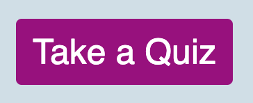
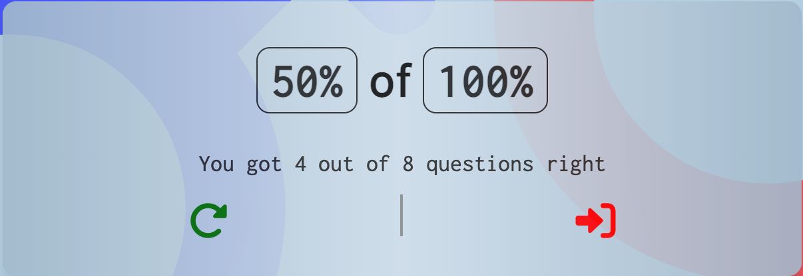
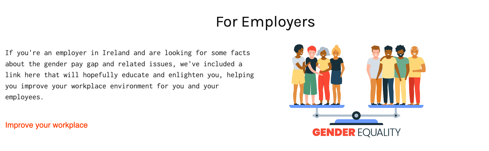
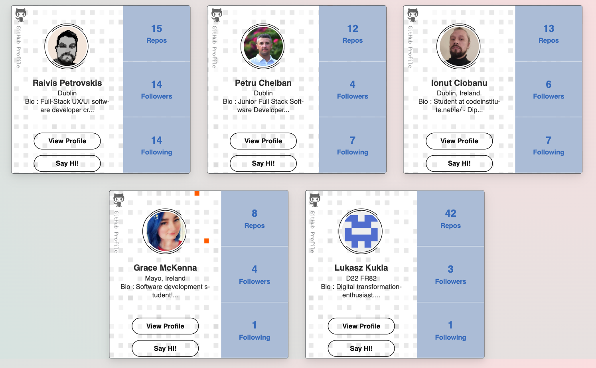
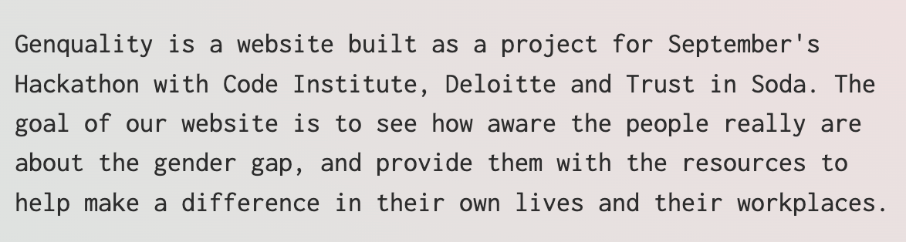
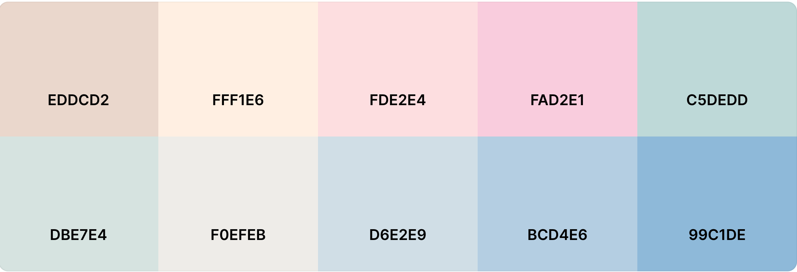

- [Site Overview](#site-overview)
  - [Goal](#goal)
  - [Technologies used](#technologies-used)
- [UX](#ux)
  - [Target Audience](#target-audience)
  - [User Stories](#user-stories)
- [Features](#features)
  - [Existing Features](#existing-features)
  - [Future Features](#future-features)
- [Design](#design)
  - [Wireframes](#wireframes)
  - [Typography](#typography)
  - [Images](#images)
  - [Colour Scheme](#colour-scheme)
- [Testing](#testing)
  - [Functional Testing](#functional-testing)
  - [Browser Testing](#browser-testing)
  - [Bugs](#bugs)
  - [Known Issues](#known-issues)
- [The Team](#the-team)
  - [Our members](#our-members)
  - [Issues Encountered](#issues-encountered)
- [Credits](#credits)
    - [Github cards](#github-cards)
    - [Images](#images-1)
    - [Version Control](#version-control)
- [Acknowledgments](#acknowledgments)

# Site Overview
Genquality is a website built as a project for September's Hackathon with Code Institute, Deloitte and Trust in Soda. The theme given was 'Closing the gender gap' and so we decided a good way to tackle this issue was with an educational and enlightening quiz, along with some resources and information on how the user can make a difference.

## Goal
The goal of our website is to see how aware the user really is about the gender gap. Some users might be shocked by some of the facts and statistics, while others may not. For those with less knowledge about the topic, we want to provide resources where they can learn more and also how they can help close the gap in their workplace and their life. The overall aim of this project is to bring awareness to the inequality in workplaces, each gender being affected in different ways.

## Technologies used

- [HTML5](https://en.wikipedia.org/wiki/HTML5) for the contents and structure of the website.
- [CSS3](https://en.wikipedia.org/wiki/CSS) for the styling and animations.
- [Balsamiq](https://balsamiq.com/) for wireframing.
- [GitPod](https://gitpod.io/) as a local IDE & repository.
- [GitHub](https://github.com/) as a remote repository.
- [GitHub Pages](https://pages.github.com/) to deploy the website.
- [Chrome](https://www.google.com/intl/en_ie/chrome/),  [Firefox](https://www.mozilla.org/en-US/firefox/new/),
[Brave Browser](https://brave.com/),
[Edge](https://www.microsoft.com/en-us/edge) and [Opera](https://www.opera.com/) for browser testing the responsiveness.
- [Chrome Developer Tools](https://developer.chrome.com/docs/devtools/) for testing screen sizes and using [Lighthouse](https://developers.google.com/web/tools/lighthouse).
- [Remove Image Background](https://www.remove.bg/) to remove background from logo.
- [Wave Chrome extension](https://wave.webaim.org/) to check web accessibility.
- [Pesticide Chrome extension](https://chrome.google.com/webstore/detail/pesticide-for-chrome-with/neonnmencpneifkhlmhmfhfiklgjmloi) during development.
- [Am I Responsive](http://ami.responsivedesign.is/) for testing and to make responsive image.
- - [JS](https://developer.mozilla.org/en-US/docs/Web/JavaScript) functions and examples.
- [Visual Studio Code](https://code.visualstudio.com/) as a local IDE & repository.
- [Favicon.io](https://favicon.io/favicon-generator/) to create a favicon.
- [Font Awesome](https://fontawesome.com/) for icons.
- [TinyPNG](https://tinypng.com/) to optimize images.

# UX
## Target Audience
* Employees
* Employers
* Activists

## User Stories
* As a first time visitor to the website, I want to know what it's about as soon as I land on the home page.
* As a user, I want to be able to navigate the website easily and always know what page I'm on.
* As a user I want to be able to have quick access to a fun quiz from both the landing page and a dedicated area in the nav bar.
* As a user, I want to find out more information relating to the topic with ease.
* As a user, I want to find out who created the website and why it was made.
# Features

## Existing Features
* __Hero image__
  - User story: *As a first time visitor to the website, I want to know what it's about as soon as I land on the home page.*
  - We chose a hero image that we felt conveys the topic of the website immediately and catches attention.
  - Over the hero image, we have some text reiterating the point of the website.
  

* __Navigation Bar__
  - User story: *As a user, I want to be able to navigate the website easily and always know what page I'm on.*
  - Our nav bar includes the website title, logo and links to all main aspects of the website.
  - Whichever page the user is currently on is highlighted in the nav bar.

* __Quiz Button__
  - User story: *As a user I want to be able to have quick access to a fun quiz from both the landing page and a dedicated area in the nav bar.*
  - We included a button that redirects the user straight to the quiz page from the landing page. 
  - This means the user can go straight from reading about the topic to the quiz.

* __Landing Page Information & Graphic__
  - User story: *As a first time visitor to the website, I want to know what it's about as soon as I land on the home page.*
  - Also included on the landing page is a colourful graphic to portray the topic.
  - Beside it we also have included a small paragraph of text stating some information about the topic, so that the user has a brief idea what the website entails.

* __Quiz__
  - Our quiz that was built using JavaScript gives a series of 8 questions. 
  - Should the user answer correctly, the quiz moves onto the next question.
  - If the user answers incorrectly, the quiz gives an explanation as to why they are wrong.

  - At the end of the quiz, it displays the user's results and the option to restart or exit.
  - The exit button brings the user straight to the resources page so that they can learn more about the topic and perhaps improve their score in the future.

* __Resource Panels__
  - User story: *As a user, I want to find out more information relating to the topic with ease.*
  - Because our target audiences were specifically employers, employees and activists, we included a resource section for each.
  - Each section has a link to information relevant to each audience target.
  
  

* __About Us Cards__
  - User story: *As a user, I want to find out who created the website and why it was made.*
  - The last thing we wanted to include was a brief introduction to the team behind our project.
  - To do this we used some cards to display each team member's github profile.

* __About the Project__
  - The final thing we included was a short informational paragraph about the project and why it was created. 
  - We left this until the end as we felt the main purpose of the website was more important than explaining the origin of the project.

## Future Features

Should we continue to work on this project, there are a number of features we would like to implement to improve the website. 
- Add a scoreboard for quiz results
- Expand the questions pool
- Add images to questions
- Expand social media integration

# Design
We went into this project with the aim of being unbiased to any gender, and also making the information as clear and concise as possible. 

## Wireframes

[Wireframe](docs/wireframes/wireframe.png)

## Typography

For our fonts, we decided to use 'Karla', a sans serif font, and 'Inconsolata'. We felt these two fonts complimented each other well; the simplicity of 'Inconsolata' helping us portray our information as factual and official.

## Images

Images that were used varied from stock images of co-workers, to protest signs and cartoon illustrations. We wanted to show all the different sides to this topic and we feel the images we've chosen show this.

## Colour Scheme

For our colour scheme, we used coolors.co to generate a palette that we felt was neutral enough not to bias any particular gender, and was also light enough that text and other images would contrast well with the colours. 

# Testing

## Functional Testing
- Upon opening the site link incorrectly: 404 Page should load automatically - Tested, the 404 Page loads up.
- Upon opening the site link correctly: Homepage (start screen) should open - Tested, the site loads up.
- From Homepage pressing on the nav links:
  * Home - takes the user to the Homepage - Tested works as intended.
  * Quiz and Take a Quiz button - takes the user to the Quiz page - Tested works as intended.
  * Resources - takes the user to the Resources Page - Tested works as intended.
  * About - takes the user to the About Page - Tested works as intended.
- From Quiz page pressing on the nav links
  * Home - takes the user to the Homepage - Tested works as intended.
  * Quiz - takes the user to the Quiz page - Tested works as intended.
  * Resources - takes the user to the Resources Page - Tested works as intended.
  * About - takes the user to the About Page - Tested works as intended.
  * Green Checkbox - starts the quiz - Tested works as intended.
      - Green Checkbox - submit true answer to the question - Tested works as intended.
      - Red X - submit false answer to the question - Tested works as intended.
      - Green arrow - allows user to move to the next question before the correct answer box disappears. - Tested works as intended.
      - When Quiz is finished:
          * Green circle arrow - retake the quiz - Tested works as intended.
          * Red right arrow - exit the quiz and open resource page  - Tested works as intended.
   * Red X - takes the user back to the homepage
 - Resource page - relevant links in different sections takes the user to external resources.
      * Home - takes the user to the Homepage - Tested works as intended.
      * Quiz - takes the user to the Quiz page - Tested works as intended.
      * Resources - takes the user to the Resources Page - Tested works as intended.
      * About - takes the user to the About Page - Tested works as intended.
  - About page:
      * Home - takes the user to the Homepage - Tested works as intended.
      * Quiz - takes the user to the Quiz page - Tested works as intended.
      * Resources - takes the user to the Resources Page - Tested works as intended.
      * About - takes the user to the About Page - Tested works as intended.
      * GitHub cards links - Opens clicked GitHub profile - Tested works as intended.

## Browser Testing 
- Page behaves as expected in all browsers tested. The website was tested in [Chrome](https://www.google.com/intl/en_ie/chrome/), [Firefox](https://www.mozilla.org/en-US/firefox/new/),
[Brave Browser](https://brave.com/),
[Edge](https://www.microsoft.com/en-us/edge) and [Opera](https://www.opera.com).

- On the mobile and tablet website was tested in
[Chrome](https://play.google.com/store/apps/details?id=com.android.chrome), [Firefox](https://play.google.com/store/apps/details?id=org.mozilla.firefox).

- Best Practices:

    - HTML doc type included in the html for all pages.

- Search Engine Optimization:

    - Semantic HTML included in all internal pages created.

    - All links have descriptive text added.

    - Alt attributes added to all images.

    - Meta-data descriptions added to each internal page created.
## Bugs

Bug | Status 
----|-------
Quiz page would not scroll| Resolved
Focus remained on button on quiz page| Resolved
Quiz container moved to the corner of page| Resolved

## Known Issues
External code used has caused a number of known issues.
* Github cards display good only as low as 330px
* Github cards lack alt tags reducing accessibility.

# The Team
## Our members
* https://github.com/petrugio
* https://github.com/Raivis80
* https://github.com/lukaszkukla
* https://github.com/Tiyko
* https://github.com/gracemcken

## Issues Encountered

As this was the first group project for many of our team members, it presented a learning curve for everyone! Among the issues outside of actual bugs that we encountered as a team was:
- Some members using px vs rem/em
- Difficultly with push/pull and merging
- Min width vs max width for pages
  
 
  Our main overall issues relate to the fact that each team member had different ways and habits of doing things, so to make our code across all pages consistent was a challenge. We resolved as much as we could once the majority of the code was finalised and fixed inconsistencies during final clean up before submission.

# Credits

### Github cards
Github cards were generated using [GitHub Dev Widget](https://github-devprofile-card.netlify.app/generate).

### Images
* Some images were taken from [pexels.com](pexels.com).
* Other images were taken from [freepik.com](freepik.com)

### Version Control
*   Git was used as the version control software. Commands such as git add ., git status, git commit and git push were used to add, save, stage and push the code to the GitHub repository where the source code is stored.

* [GitKraken](https://www.gitkraken.com/) was also used for git version control when working locally from the PC.

# Acknowledgments

A big shout out to [Code Institute](https://codeinstitute.net/ie/) 
                   [Deloitte](https://www2.deloitte.com/ie/en.html)
                   [Trust in SODA](https://www.trustinsoda.com/)

for providing us with the opportunity to Participate in this Hackathon.
Also to our facilitator Chris, whom was immensely helpful during this project.